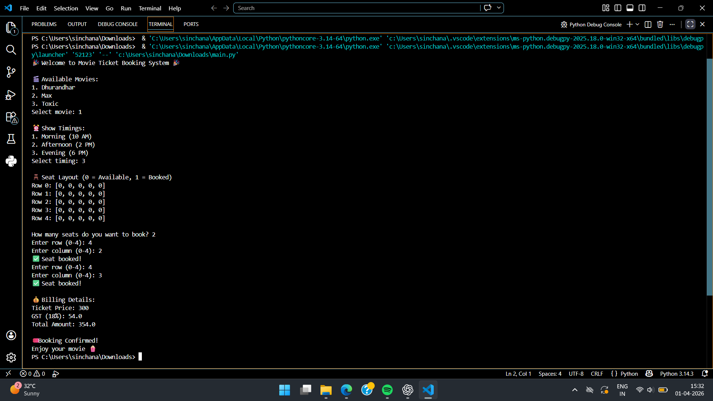

# movie-ticket-booking-system
Python microproject for movie ticket booking
# 🎬 Movie Ticket Booking System

 Description
This project is a simple Python-based movie ticket booking system. It simulates real-world ticket booking by allowing users to select a movie, choose show timings, book seats, and calculate the total price including GST.

 Movies Available
- Dhurandhar
- Max
- Toxic

 Features
- Movie selection
- Show timing selection
- Seat booking using 2D list
- Prevents double booking
- Price calculation with GST
- Booking confirmation

 Technologies Used
- Python 3

How to Run
1. Download the file
2. Open terminal / command prompt
3. Run:
   python main.py

## 📸 Output

## 👨‍💻 Team Members
- Sinchana Nayak [2511021060717]
- D MONISH [2511021060686]
- MANOJ KUMAR M [2511021060729]
- SHAIKH HAFSHA ANJUM [2511021060698]
- KURBA LOKESH [2511021060712]
  
